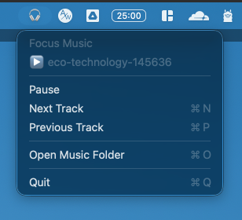
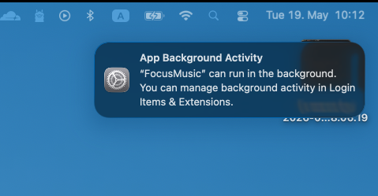

# 🎧 FocusMusic

A tiny macOS menu-bar app that automatically starts playing your focus music when you plug in headphones — and pauses itself if you're in a call.

No more manually opening Spotify or Apple Music every time you put on your headphones. FocusMusic is always running in the background, watching for your headphones and respecting your calls.



## The Problem

Every day, I have a folder of curated focus music at `~/Music/Focus`. When I sit down to work and put on my headphones, I have to:

1. Open a music app
2. Navigate to the right playlist
3. Hit play

And if I join a Zoom call with music still playing, it's embarrassing. I wanted something **smarter** — an app that just *knows* when my headphones are on and whether I'm in a call.

## The Solution

FocusMusic is a lightweight native macOS agent that:

- **Detects your headphones** via CoreAudio the moment they connect (wired, Bluetooth, AirPods, etc.)
- **Auto-plays** music from `~/Music/Focus`, shuffling through your local files
- **Pauses during calls** by monitoring microphone usage — when Zoom, Teams, FaceTime, or any app uses your mic, music stops automatically and resumes when the call ends
- **Menu bar control** — see what's playing, pause, skip, or open the folder with one click
- **Media keys work** — F8 (play/pause), F9 (next), F7 (previous) control FocusMusic while it's active
- **Always on** — runs as a LaunchAgent, starts on login, lives in your status bar



## Installation

### One-liner

```bash
git clone https://github.com/rightsum/focusmusic.git
cd focusmusic
./install.sh
```

### What `install.sh` does

1. Compiles the Swift app (`main.swift`)
2. Creates `~/Music/Focus` if it doesn't exist
3. Copies the binary to `~/.local/bin/FocusMusic`
4. Registers a LaunchAgent so it auto-starts on login

### Add your music

Drop audio files into:

```
~/Music/Focus
```

Supported formats: `.mp3`, `.m4a`, `.wav`, `.aiff`, `.aac`, `.caf`, `.mp4`, `.flac`

Then plug in your headphones. It should detect them, show a notification, and start shuffling.

### Uninstall

```bash
./uninstall.sh
```

This removes the binary and the LaunchAgent.

## How It Works

### Headphone Detection

The app listens to macOS's default audio output device via CoreAudio. When the device name matches known headphone keywords, it triggers playback. It also polls every 2 seconds as a fallback for Bluetooth reconnects that CoreAudio events sometimes miss.

Keywords include: `headphone`, `airpods`, `earbuds`, `beats`, `bose`, `sony`, `wh-`, `xm5`, `buds`, `bluetooth headset`, and more.

**If your headphones aren't detected**, check `~/.focusmusic.log` for the exact device name and add it to the `headphoneKeywords` array in `main.swift`, then re-run `./install.sh`.

### Call Detection

Every 5 seconds, the app checks if the default input microphone is actively recording (`kAudioDevicePropertyDeviceIsRunningSomewhere`). This covers:

- FaceTime
- Zoom
- Microsoft Teams
- Slack huddles
- Any app using the mic

If a call starts during playback, music pauses immediately with a notification. When the mic goes idle, it resumes (unless you manually paused).

### Media Keys

FocusMusic registers with `MPRemoteCommandCenter` so macOS routes the physical media keys to it while it's the active audio player. If another app (Spotify, Apple Music) recently played audio and is still the "Now Playing" app, you may need to pause that app first for the keys to route to FocusMusic.

## Development

### Project Structure

```
.
├── main.swift          # Complete Swift source
├── install.sh          # Build + install script
├── uninstall.sh        # Remove script
├── build/              # Compiled binary
├── assets/             # Screenshots
├── .pi/                # Pi agent development context
└── .claude/            # Claude agent development context
```

### Build manually

```bash
swiftc -framework Cocoa -framework CoreAudio -framework AVFoundation -framework MediaPlayer main.swift -o build/FocusMusic
```

### Logs

```bash
# Live debug log
tail -f ~/.focusmusic.log

# LaunchAgent stdout/stderr
tail -f /tmp/focusmusic.out.log
tail -f /tmp/focusmusic.err.log
```

### Managing the service

```bash
# Stop
launchctl unload ~/Library/LaunchAgents/com.rightsum.focusmusic.plist

# Start
launchctl load ~/Library/LaunchAgents/com.rightsum.focusmusic.plist

# Check if running
ps aux | grep FocusMusic
```

## Architecture

- **Language**: Swift (AppKit + CoreAudio + AVFoundation + MediaPlayer)
- **UI**: `NSStatusBar` menu-only app, no dock icon
- **Persistence**: `launchd` LaunchAgent (`com.rightsum.focusmusic`)
- **Session**: `LimitLoadToSessionType: Aqua` ensures menu bar + notifications work in the GUI session
- **Playback**: `AVAudioPlayer` for direct local-file playback
- **Notifications**: Legacy `NSUserNotification` (functional but deprecated; migration to `UserNotifications.framework` is a future TODO)

## Known Limitations

- Media keys may conflict with Spotify / Apple Music if those apps were the last "Now Playing" app. Click the FocusMusic menu bar icon to reassert focus.
- Uses deprecated `NSUserNotification` API. Works on macOS 15 but should migrate to `UserNotifications.framework`.
- No volume control from the app itself — use system volume.
- No playlist persistence; reshuffles on every launch.
- Only plays local files, not Spotify / Apple Music streams.

## License

MIT

## Credits

Built by [@rightsum](https://github.com/rightsum) with a little help from Pi and Claude.
