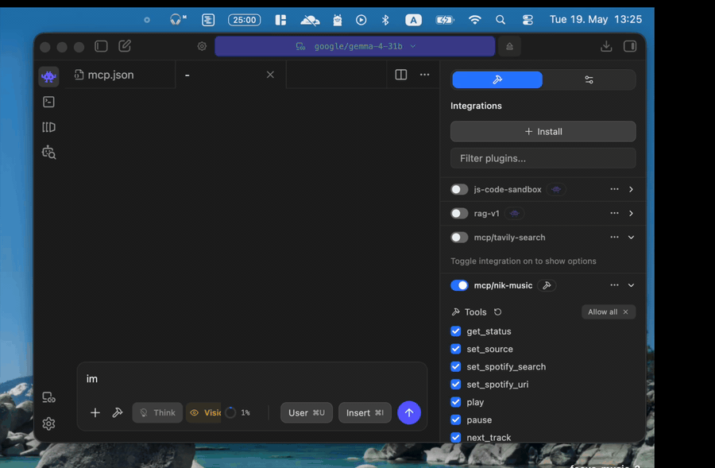

# Nik-Music

<p align="center">
  
</p>

A tiny macOS menubar app that solves two annoying problems with the music you listen to all day.

## The two problems

**1. Friction.** You put your headphones on. You want music. So you unlock your laptop, find Spotify, scroll for something, hit play. Then a call comes in — pause. Hang up — find your place again. Take the headphones off — pause again. Every transition has a tax.

**2. Static music.** Playlists don't know you. They don't know it's raining, that you just finished a four-hour focus block, that it's Friday evening, or that today is rough and you need something gentler. They play the same shuffled mood at 9am Monday as they do at 11pm Friday.

Nik-Music removes both.

- **Headphones in → music starts. Mic active (call) → pause. Headphones out → pause.** No more thinking about it.
- **An MCP server exposes the music to your AI agents.** Tell OpenClaw, Claude, LM Studio, OpenCode, or any MCP-capable assistant what's going on in your day, and it picks the music. The model has tools to search Spotify, set what plays, and control playback — so "set the vibe for a rainy Sunday morning" or "I have a deep-focus block until 11, then a 1:1, then errands — score the rest of my afternoon" becomes a single sentence to your agent.

---

## What context-aware music looks like

The point of wiring music into your agent is that it can read context you'd otherwise type into Spotify search yourself.

A few prompts that work today:

> "Look at the weather and play something that fits the mood."

> "I just finished a hard day. Set something chill. Spanish guitar or lo-fi, your call."

> "Read my calendar — I have a deep-focus block until 11, then a 1:1, then admin. Pick music for the focus block."

> "It's Friday night. Pick the vibe."

> "Play more from the artist that's currently on, but pick the chiller half of their catalogue."

> "I'm cooking — something upbeat but not aggressive."

The agent calls the MCP tools (`get_status`, `set_spotify_search`, `play`, etc.) to do the work; you don't have to know they exist.

---

## Quick start

### Requirements

- macOS 11+
- Swift toolchain (`xcode-select --install` if you don't have it)
- A Spotify account with **Premium** (the Web API only allows playback control on Premium)
- A free Spotify Developer app (instructions below)

### Install

```bash
git clone <this repo>
cd music-app-mac
./install.sh
```

This builds the binary, drops it in `~/.local/bin`, installs a LaunchAgent so it starts at login, and creates `~/.nikmusic.json` with defaults. A 🎵 should appear in your menubar.

### Uninstall

```bash
./uninstall.sh
```

---

## First-time Spotify setup

You need to create a tiny Spotify Developer app so Nik-Music can use the Web API on your behalf. This takes about 90 seconds and is free.

1. Go to <https://developer.spotify.com/dashboard> and log in with your Spotify account.
2. Click **Create app**.
3. Fill in:
   - **App name:** anything (e.g. `Nik-Music`)
   - **App description:** anything
   - **Redirect URI:** `http://127.0.0.1:8765/callback` — must be **exactly** this, including the scheme and port.
   - **Which API/SDKs are you planning to use:** check **Web API**.
4. Save. On the app's page, copy:
   - **Client ID**
   - **Client Secret** (click "View client secret")
5. Open `~/.nikmusic.json` and add the two fields:
   ```json
   {
     "source": "spotify",
     "shuffle": true,
     "spotifyClientId": "your-client-id-here",
     "spotifyClientSecret": "your-client-secret-here"
   }
   ```
6. Click the menubar 🎵 → **Source → Spotify**, then click **Authorize Spotify…**. Your browser opens, you approve, and you'll see an "Authorized" page. That's it — tokens are stored and auto-refresh from then on.

> **Don't paste your client secret into public chats, screenshots, or commits.** If you do, rotate it from the dashboard (Edit settings → Rotate client secret) and update the file.

---

## Connect an AI agent

The menubar app speaks MCP over HTTP+SSE on `http://127.0.0.1:8765/sse`. Any MCP client can connect.

### Turn the server on

Menubar 🎵 → **MCP Server → Start MCP Server**. Once you turn it on, it'll auto-start every login. The menubar icon picks up a small `ᴹ` when MCP is running.

### Get the config snippet

Menubar 🎵 → **MCP Server → Copy MCP Config**. The clipboard now has:

```json
{
  "mcpServers": {
    "nik-music": {
      "url": "http://127.0.0.1:8765/sse"
    }
  }
}
```

Paste it into your client of choice:

| Client | Where to paste |
|---|---|
| **Claude Desktop** | Settings → Developer → Edit Config → merge into `claude_desktop_config.json` → restart |
| **Cursor** | Settings → MCP → New server → paste → restart |
| **LM Studio** | Program → Settings → mcp.json → merge → restart |
| **OpenCode** / **Claude Code** | Add via `claude mcp add nik-music --transport sse http://127.0.0.1:8765/sse` (or your client's equivalent) |

---

## MCP tools the agent can call

| Tool | Description |
|---|---|
| `get_status` | Current source, headphone connect state, mic state, what's playing |
| `set_source` | Switch between `local` and `spotify` |
| `set_spotify_search` | Set a free-text query (e.g. `"Sogand"`, `"chill Sunday morning"`, `"sad piano"`); plays immediately by default. Searches artists first (with name match), then playlists, albums, tracks. |
| `set_spotify_uri` | Set an explicit `spotify:artist:…` / `:playlist:…` / `:album:…` / `:track:…` URI |
| `play` | Resume / start playback |
| `pause` | Pause |
| `next_track` | Skip forward |
| `previous_track` | Skip back |

Playback writes go through Spotify's Web API (`PUT /v1/me/player/*`) — no AppleScript flakiness, switches reliably even when something is already playing, and works against whichever device is active on your account.

---

## Configuration reference

File: `~/.nikmusic.json`

| Key | Type | Purpose |
|---|---|---|
| `source` | `"local"` \| `"spotify"` | Which backend to use |
| `shuffle` | bool | Shuffle local files |
| `musicFolder` | string? | Local music directory (default `~/Music/Focus`) |
| `spotifyClientId` | string | From your Spotify Developer app |
| `spotifyClientSecret` | string | From your Spotify Developer app |
| `spotifySearchQuery` | string? | Last search the controller used |
| `spotifyUri` | string? | Explicit URI override |
| `spotifyAccessToken` | string | Set by OAuth; auto-refreshed |
| `spotifyRefreshToken` | string | Set by OAuth |
| `spotifyTokenExpiry` | number | Set by OAuth (Unix epoch seconds) |
| `mcpPort` | number | MCP server port (default 8765) |
| `mcpAutoStart` | bool | Start MCP automatically at login |

---

## Local files mode

If you don't want Spotify at all, drop audio files into `~/Music/Focus` (or set `musicFolder`) and switch source to `Local Files`. Headphones-in still triggers playback, mic-active still pauses, media keys still work.

---

## Permissions

The first time the app does any of these, macOS will prompt:

- **Accessibility / Apple Events** — only needed if you ever fall back to a local Spotify operation; not used in normal Web API mode.
- **Notifications** — used for the "Headphones detected" and "MCP started" toasts. macOS doesn't always grant these for unsigned LaunchAgents; the menubar icon is the source of truth either way.
- **Network** — outbound to `accounts.spotify.com` and `api.spotify.com`; inbound only on `127.0.0.1:8765` for MCP + OAuth callback.

No telemetry, no remote endpoints, no analytics. Everything stays on your machine and your Spotify account.

---

## Troubleshooting

| Symptom | Fix |
|---|---|
| Menubar shows 🎵 but no ᴹ | MCP server is off → Start MCP Server |
| "Spotify not authorized" notification | Click **Authorize Spotify…** in the menubar |
| OAuth page says `INVALID_REDIRECT_URI` | The Redirect URI in the Spotify dashboard doesn't match `http://127.0.0.1:8765/callback` exactly |
| `Authorize Spotify…` doesn't open the browser | Check `~/.nikmusic.log` — usually means `spotifyClientId` is missing from the config |
| Web API returns 403 on play | Spotify Premium required for `PUT /v1/me/player/*` |
| Web API returns 404 NO_ACTIVE_DEVICE | The app tries to launch Spotify and retry; open Spotify manually if it still fails |
| Logs | `tail -f ~/.nikmusic.log` |

---

## Privacy and trust

This is a personal, single-user, local-only app. Your Spotify tokens live in `~/.nikmusic.json` in plaintext (same trust model as a `.env` file). If that's not your bar, encrypt your home directory or move the file into Keychain — PRs welcome.

The MCP server **only binds to `127.0.0.1`**. Nothing on your local network or the internet can reach it.

---

## License

MIT.
